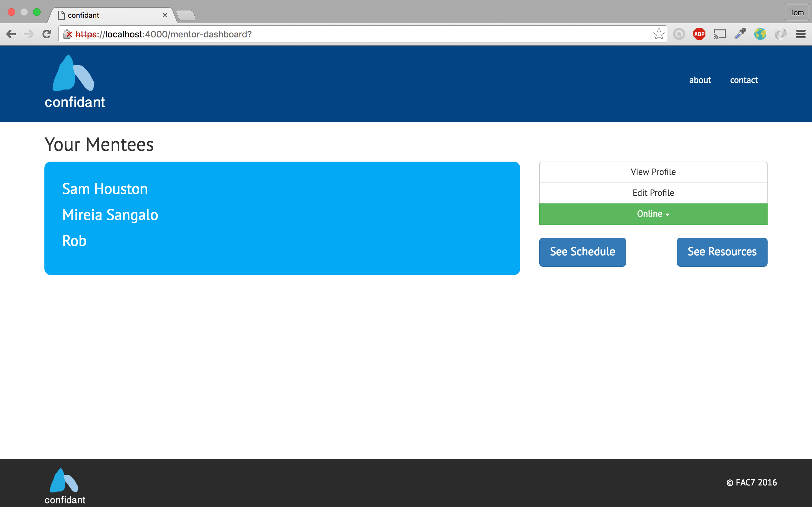

#Confidant

A mentoring platform prototype which allows users to communicate securely through IPCortex's WebRTC API.

__Mentors can:__
* Login/logout securely
* Sign up and add personal details to their profile
* Communicate with their mentees using real-time video chat
* View notes about mentees they have interacted with

__Mentees can:__
* Login/logout securely
* See a list of available mentors
* Engage in a video chat with a mentor of their choice
* Choose to have appointment reminders sent to their mobile phone

###Main Involvement
* React Bootstrap component integration
* Frontend styling

###Login Page

###Mentor Details Page

###Mentor's List of Mentees Page (accordion closed)

###Mentor's List of Mentees Page (accordion open to reveal mentee's notes)

###Mentee's Available Mentors Page

###Video Chat

###Technology Stack
- Hapi.js (Node.js Framework)
- Redis
- React
- React Bootstrap
- SASS

###Links
- [Github Repository](https://github.com/eleanorreem/webrtc)
