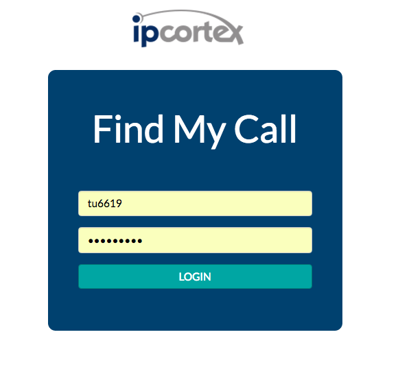
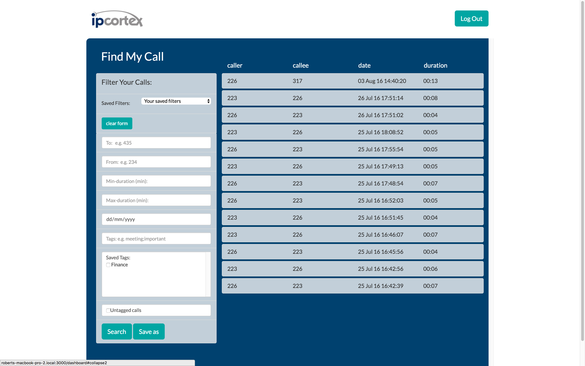
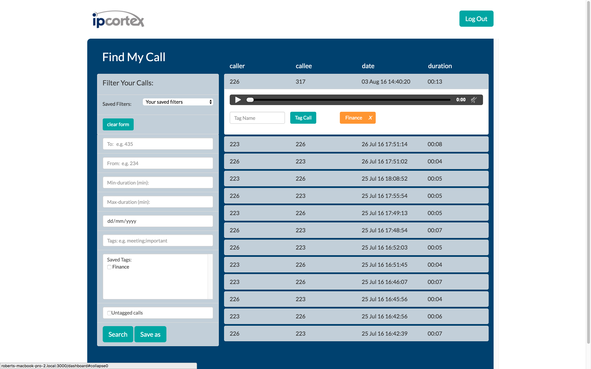
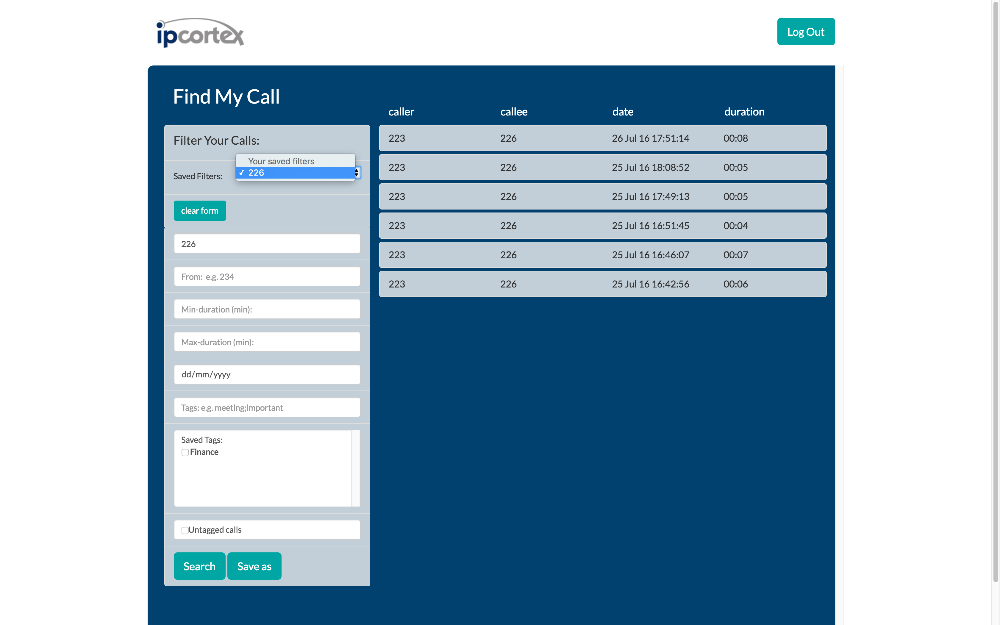

#Find My Call

An audio-archiving app for a WebRTC (Web Real-Time Communication) client - IPCortex.
The user working for a company supplied by IPCortex's WebRTC API:
* Can login / logout securely
* Is authorised with a (JWT) session token
* Can view all calls they participated in while working for the company in question
* Can tag calls
* Can filter calls by date, duration, number and tags
* Can create and save custom filters
* Can listen to their calls

###Main Involvement
* Authentication / Authorisation
* Database functions / Query strings

###Login Page

###Dashboard Page

###Dashboard Page (accordion open to reveal audio player)

###Dashboard Page (filtering calls by number)

###Technology Stack
- Hapi.js (Node.js Framework)
- PostgresQL
- Bootstrap
- Handlebars (html templating engine)
- CSS3

###Links
- [Github Repository](https://github.com/ipcortex/FAC-FMC)
