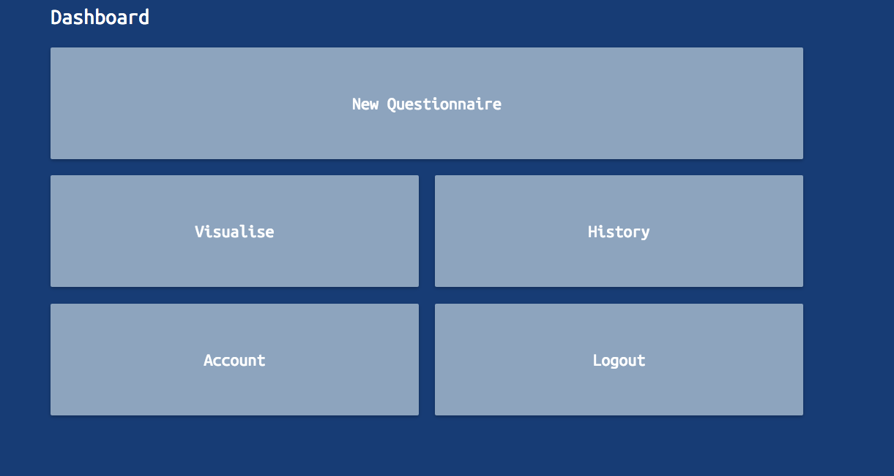
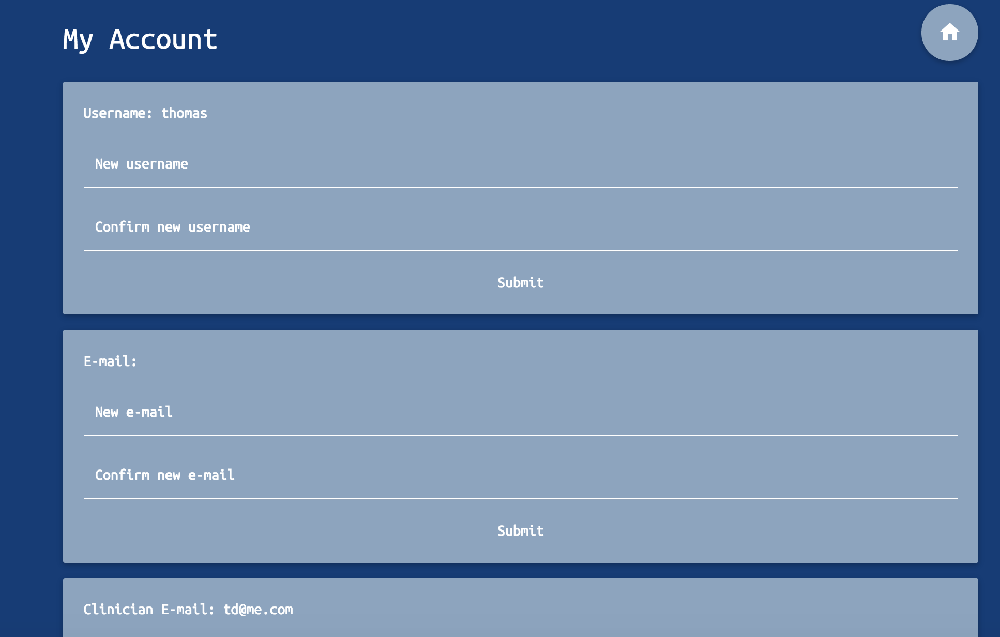
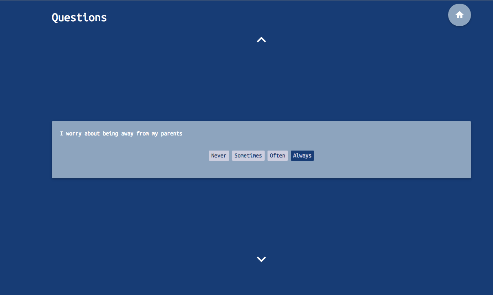
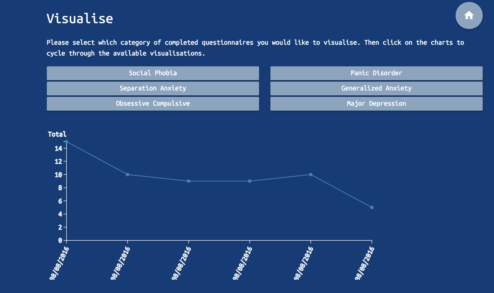
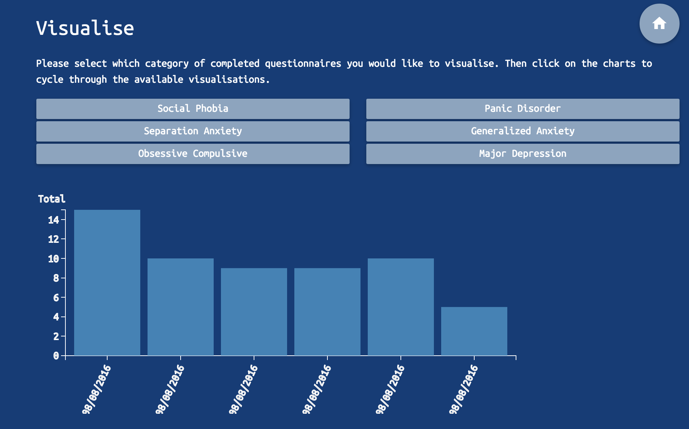
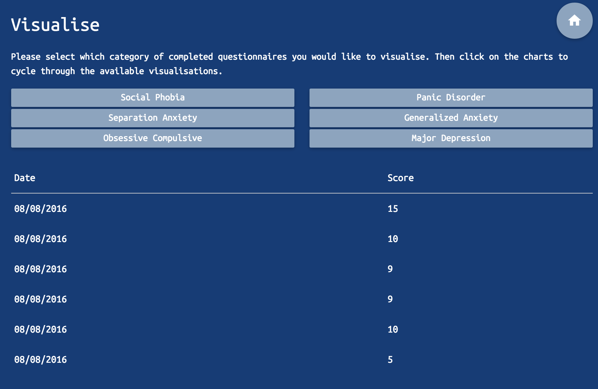
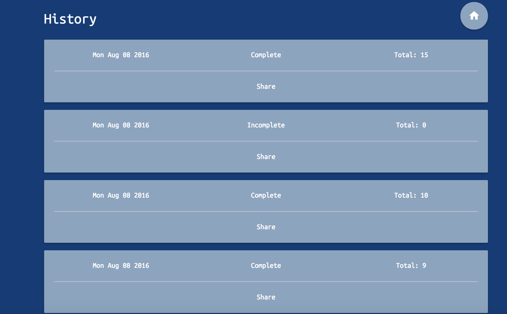
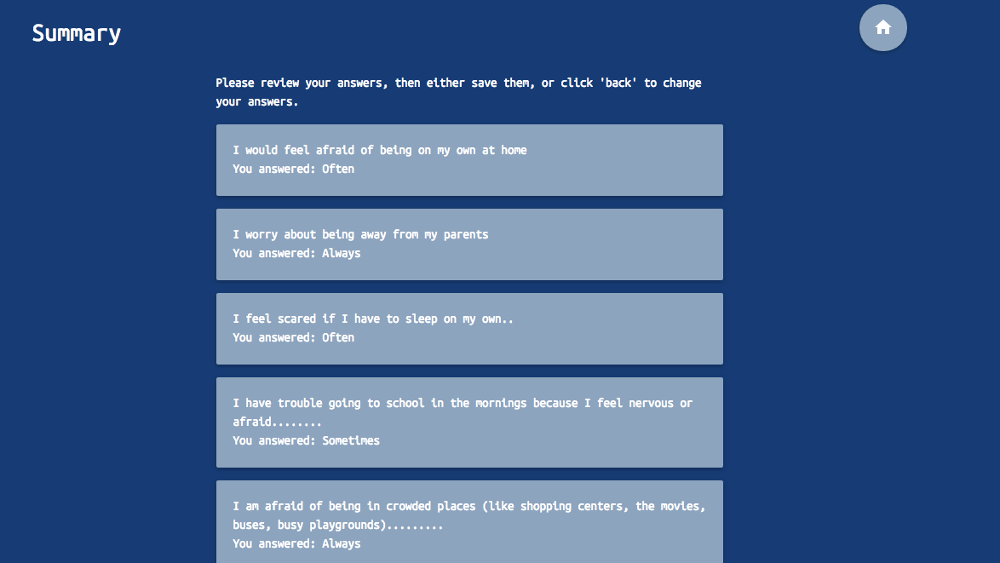

#How am I Doing?

A test-driven app to help young people with mental health issues own and visualise their data. Built for the Anna Freud Centre, a charity dedicated to child mental health. User can:
* Login/ logout securely
* Create an account
* Complete questionnaires
* Visualise the data from completed questionnaires
* Contact a clinician
* Review past questionnaires

###Main Involvement
* Logo design
* Implementing graphic data visuals
* Frontend layouts
* Frontend styling

###Dashboard Page

###Account Page

###Questionnaire Page (one question visible on carousel)

###Visualisation Page (line graph)

###Visualisation Page (bar graph)

###Visualisation Page (table)

###History Page

###Summary Page

###Technology Stack
- Hapi.js (Node.js Framework)
- PostgresQL
- Sketch
- Plotly (D3 Library)
- SASS
- Materialize
- Handlebars (html templating engine)

###Links
- [App](https://howamidoing.herokuapp.com/)
- [GitHub Repository](https://github.com/foundersandcoders/How-Am-I-Doing)
