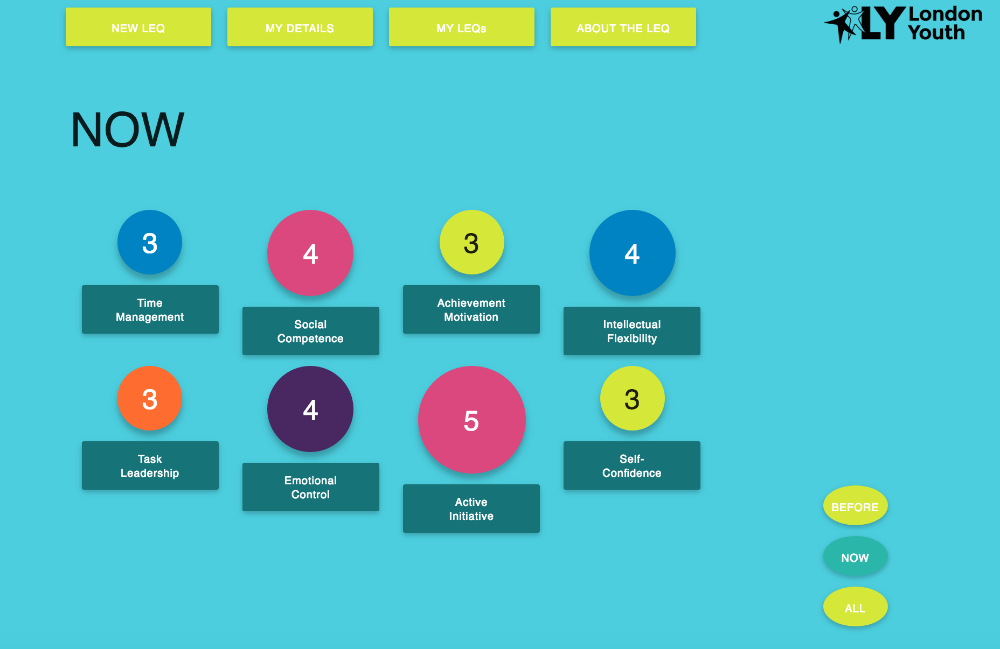
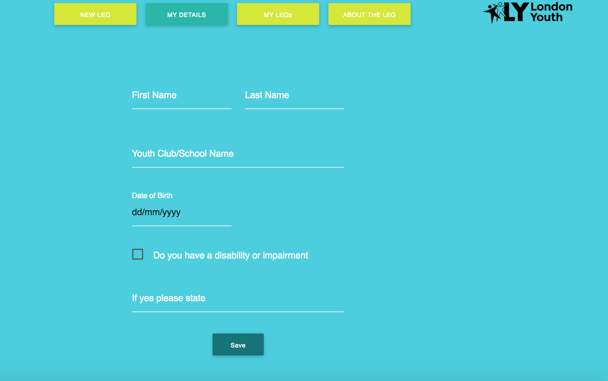

#Life Effectiveness Questionnaire App for London Youth

An proof-of-concept app built in a two-day hackathon that enables young people to fill out a life effectiveness questionnaire (LEQ) online, visualise their results and compare them to a set of previous results. User can:
* Fill in their personal details
* Complete an LEQ
* Visualise the data from completed LEQ
* Compare their results with a previous LEQ

###Main Involvement
* Responsive design
* Frontend layouts
* Frontend styling

###Home Page

###LEQ Slider

###Visualisation Page (user score determines bubble size)

###Personal Details Form

###Technology Stack
- ReactJS
- React Materialize
- SASS
- Handlebars (html templating engine)

###Links
- [App](https://tu6619.github.io/)
- [GitHub Repository](https://github.com/tu6619/tu6619.github.io)
